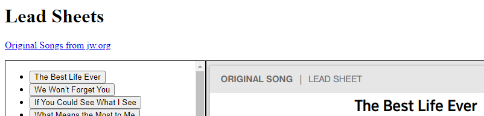

# JWLeadSheets
JW [Lead Sheets](README.md) (Partituras / 악보 / 主旋律谱版) no incluye las partituras.

Solo lista y muestra los archivos PDF disponibles localmente en la misma carpeta, así que hay que descargar las partituras primero.

## Cómo usar JWLeadSheets

1. Descargar las partituras *PDF* de jw.org
    - Todo junto, según el idioma
      - Use el archivo *PS1* PowerShell script, correspondiente al idioma, para descargar todas las canciones
    - Individualmente
      - [Original songs](https://www.jw.org/en/library/music-songs/Original-Songs/)
      - [原创歌曲](https://www.jw.org/cmn-hans/多媒体图书馆/音乐/原创歌曲/)
      - [오리지널송](https://www.jw.org/ko/라이브러리/music-songs/오리지널송/)
      - [Canciones](https://www.jw.org/es/biblioteca/musica-canciones/canciones-originales/)
2. Abrir el archivo *HTML* correspondiente al idioma

Ejemplo de LeadSheets_E.html

